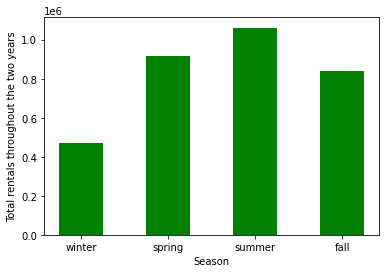
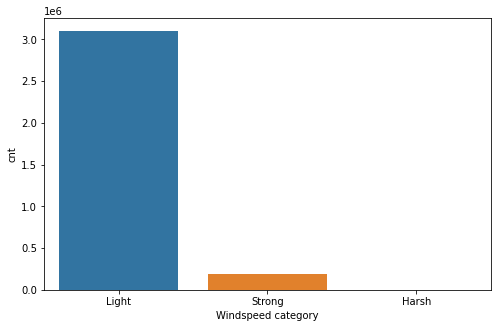
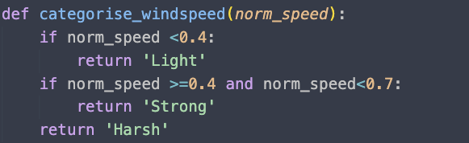
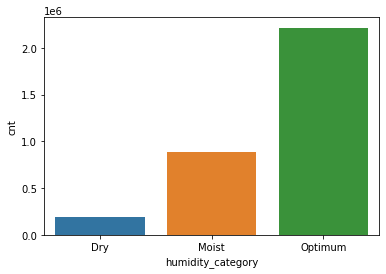
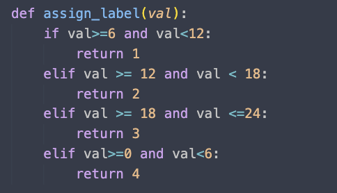

Bike Rental Project

---

Project Overview

The cities in US have communal bike sharing stations/systems where one can rent bicycles. Using these systems, users can rent bicycles from one station to travel to another station and then return the bike back at another station. The demand for bike rental stations and the bikes have increased. We will leverage the data available on University of California's website, which was sourced by 'Capital Bikeshare'. We will investigate the data to learn how different factors affect the amount of bike rentals made by the city of Washington D.C.  Then we will use the findings and train a machine learning model to predict how many total bike rentals would the users in the city make under different conditions in a particular hour of any day.

---

About the data

The data I will use in this project will be available [herehttps://archive.ics.uci.edu/ml/datasets/Bike+Sharing+Dataset]()). The dataset contains the hourly and daily count of rental bikes between January 1st, 2011 to December 19th, 2012. It also contains weather and seasonal information.

Here we have included the details of feature columns

- instant - A unique sequential ID number for each row
- dteday - The date of the rentals
- season - The season in which the rentals occurred

  - season (1:winter, 2:spring, 3:summer, 4:fall)
- yr - The year the rentals occurred

  - year (0: 2011, 1:2012)
- mnth - The month the rentals occurred

  - mnth (1 to 12)
- hr - The hour the rentals occurred

  - hour (0 to 23)
- holiday - Whether or not the day was a holiday

  - 1 is a holiday, 0 is not
- weekday - The day of the week (as a number, 0 to 6 starting from Sunday)
- workingday - Whether or not the day was a working day

  - if day is neither weekend nor holiday is 1, otherwise is 0
- weathersit - The weather (as a categorical variable)

  - 1: Clear, Few clouds, Partly cloudy, Partly cloudy
  - 2: Mist + Cloudy, Mist + Broken clouds, Mist + Few clouds, Mist
  - 3: Light Snow, Light Rain + Thunderstorm + Scattered clouds, Light Rain + Scattered clouds
  - 4: Heavy Rain + Ice Pallets + Thunderstorm + Mist, Snow + Fog
- temp - The temperature, on a 0-1 scale
- atemp - The adjusted temperature, on a 0-1 scale
- hum - The normalized humidity, on a 0-1 scale
- windspeed - The wind speed, on a 0-1 scale. The values were divided by 67
- casual - The number of casual riders (people who hadn't previously signed up with the bike sharing program)
- registered - The number of registered riders (people who had already signed up)
- cnt - The total number of bike rentals (casual + registered)

The `cnt` variable will be our feature column.

---

Code Requirements

python version: 3.8

numpy==1.21.5

pandas==1.3.5

scikit_learn==1.1.1

streamlit==1.3.1

---

Exploratory Data Analysis

/Users/saumyamundra/Documents/Python for Machine Learning/Data Quest/Machine Learning/Bike Rental Project/Bike Rental Project GIT/Predicting Bike Rentals .ipynb In this section, I have discovered the trend/pattern in bike demand based on feature columns such as `season,workingday,weathersit`



As we can infer from the graph above, the demand for the bicycle is the maximum during the summmer. Approximately about 33% of the total demand is during the summers.



I had categorized windspeeds into three category-



The demand for bicycle is exponentially higher when the wind is light.



Similarly I categorized humidity into three categories-


---

Feature Engineering

Just like I have create categories for humidity and windspeed, I will also create one for time. 



Rather than using `pd.apply()` method we can also use `pd.cut()`method to assign labels to a range of values

---

Featue and Model Selection

In this section, I will be choosing set of feature columns one by one and will be evaluating how different models work on them. I will be using DecisionTreeRegressor , RandomForestRegressor and LinearRegressor . The specifics of the columns I have considered for each of my feature column set can be found in the notebook of the repo. To spot-check the algorithms, I have used the following code -

```
def model_feature_evaluation(feature_cols,target_col,df):
    X = df[feature_cols]
    y = df[target_col]
    X_train,X_test,y_train,y_test = train_test_split(X,y,test_size=0.3,random_state=2)
    mse = mean_squared_error
  
    model_1 = LinearRegression()
    model_1.fit(X_train,y_train)
    predictions_1 = model_1.predict(X_test)
    print(model_1,'test error : ',mse(y_test,predictions_1),'train error : ',mse(y_train,model_1.predict(X_train)))
  
    model_2 = DecisionTreeRegressor()
    model_2.fit(X_train,y_train)
    predictions_2 = model_2.predict(X_test)
    mse = mean_squared_error
    print(model_2,'test error : ',mse(y_test,predictions_2),'train error : ',mse(y_train,model_2.predict(X_train)))
  
    model_3 = DecisionTreeRegressor(min_samples_leaf=5)
    model_3.fit(X_train,y_train)
    predictions_3 = model_3.predict(X_test)
    print(model_3,'test error : ',mse(y_test,predictions_3),'train error : ',mse(y_train,model_3.predict(X_train)))
  
    model_4 = RandomForestRegressor()
    model_4.fit(X_train,y_train)
    predictions_4 = model_4.predict(X_test)
    print(model_4,'test error : ',mse(y_test,predictions_4),'train error : ',mse(y_train,model_4.predict(X_train)))
  
    model_5  = RandomForestRegressor(min_samples_leaf=5)
    model_5.fit(X_train,y_train)
    predictions_5 = model_5.predict(X_test)
    print(model_5,'test error : ',mse(y_test,predictions_5),'train error : ',mse(y_train,model_5.predict(X_train)))
```

Following this, I selected RandomForest and DecisionTree to tune its hyperparameters. After experimentation, the most optimal choices were `min_samples_leaf=9,max_depth=12 `for RandomForestRegressor. 

---

Deployment
